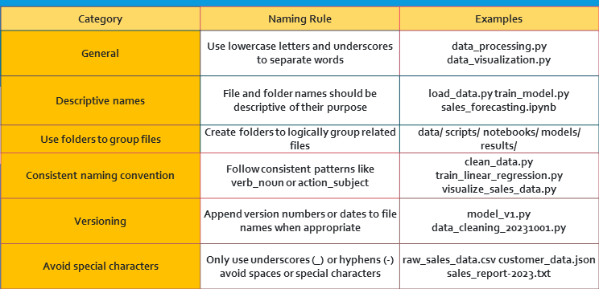

{
 "cells": [
  {
   "cell_type": "markdown",
   "metadata": {},
   "source": [
    "# 📘 **Variables and Types**\n",
    "\n",
    "# 📘 ** Variables**\n",
    "A variable is a symbolic name that references or points to an object in memory.\\\n",
    "• It allows programmers to store data and manipulate it throughout the code.\\\n",
    "• Think of a variable as a labeled box where you can place data and retrieve it when needed.\\\n",
    "In Python, declaring a variable is straightforward. You simply assign a value to a variable name using the ```= operator```.\\\n",
    "# 📘 Variable assignment\n",
    "```python\n",
    "x = 10\n",
    "name= \"Alice\"\n",
    "is_active = True\n",
    "```\n",
    "• x, name, and is_active are variables.\\\n",
    "• 10, \"Alice\", and True are the values assigned to these variables.\\\n",
    "**Note:** Unlike some other programming languages, Python does not require you to declare the type ofa variable explicitly.\\\n",
    "# 📘 Variable naming Rules\n",
    "1 . **Case-Sensitive:** Variable names are case-sensitive.\\\n",
    "a. age, Age, and AGE are three different variables.\\\n",
    "2. **Start with a Letter or Underscore:** Variable names must start with a letter (a-z, A-Z) or an underscore _.\\\n",
    "a. Valid: _value, datal\\\n",
    "b. Invalid: 1 data, #score\\\n",
    "3. **Followed by Letters, Digits, or Underscores:** After the first character,you can use letters, digits, or underscores.\\\n",
    "a. Valid: value_1, data_set\\\n",
    "b. Invalid: **data-set (hyphens are not allowed)**\n",
    "# 📘 Variables naming -Conventions\n",
    "1. **Use Lowercase Letters**\\\n",
    "a. Example: total_score, user_name\\\n",
    "2. **Avoid Reserved Keywords**\\\n",
    "a. Reserved keywordsåhclude if, else, while, for, class, def, etc.\\\n",
    "3. **Meaningful Names**\\\n",
    "a. Good: student_count, average_height\\\n",
    "b. Bad: x, y, data (unless used in a specific context)\\\n",
    "4. **Constants in Uppercase**\\\n",
    "a. Mostly used in UPPER CASE\\\n",
    "b. Example: PI = 3.1416\n",
    "\n",
    "\n",
    "\n",
    "Varible is name that refers to a value.The value can be changed,hence the name variable.In Python,varibels can be declared and values can be assigned to is as follow:\n",
    "These are the types of varibles in Python:\\\n",
    "1.Numbers\\\n",
    "2.String\\\n",
    "3.List\\\n",
    "4.Tuple\\\n",
    "5.Dicitionary\\\n",
    "6.Set\\\n",
    "7.Boolean\\\n",
    "8.None\\\n",
    "9.Bytes and Bytearray\n"
   ]
  },
  {
   "cell_type": "code",
   "execution_count": 11,
   "metadata": {},
   "outputs": [],
   "source": [
    "age = 20"
   ]
  },
  {
   "cell_type": "code",
   "execution_count": 12,
   "metadata": {},
   "outputs": [
    {
     "name": "stdout",
     "output_type": "stream",
     "text": [
      "20\n"
     ]
    }
   ],
   "source": [
    "print(age)"
   ]
  },
  {
   "cell_type": "code",
   "execution_count": 3,
   "metadata": {},
   "outputs": [
    {
     "name": "stdout",
     "output_type": "stream",
     "text": [
      "I am 20 yers old.\n"
     ]
    }
   ],
   "source": [
    "print(\"I am\",age,\"yers old.\")"
   ]
  },
  {
   "cell_type": "code",
   "execution_count": 4,
   "metadata": {},
   "outputs": [],
   "source": [
    "name=\"Khurram\""
   ]
  },
  {
   "cell_type": "code",
   "execution_count": 13,
   "metadata": {},
   "outputs": [
    {
     "name": "stdout",
     "output_type": "stream",
     "text": [
      "My name is Khurram\n"
     ]
    }
   ],
   "source": [
    "print(\"My name is\",name)"
   ]
  },
  {
   "cell_type": "code",
   "execution_count": 6,
   "metadata": {},
   "outputs": [],
   "source": [
    "is_student=True"
   ]
  },
  {
   "cell_type": "code",
   "execution_count": 7,
   "metadata": {},
   "outputs": [
    {
     "name": "stdout",
     "output_type": "stream",
     "text": [
      "Am i Student True\n"
     ]
    }
   ],
   "source": [
    "print(\"Am i Student\",is_student)"
   ]
  },
  {
   "cell_type": "code",
   "execution_count": 15,
   "metadata": {},
   "outputs": [],
   "source": [
    "height=5.10"
   ]
  },
  {
   "cell_type": "code",
   "execution_count": 14,
   "metadata": {},
   "outputs": [
    {
     "name": "stdout",
     "output_type": "stream",
     "text": [
      "My height is  5.1 feet\n"
     ]
    }
   ],
   "source": [
    "print(\"My height is \",height,\"feet\")"
   ]
  }
 ],
 "metadata": {
  "kernelspec": {
   "display_name": "Python 3",
   "language": "python",
   "name": "python3"
  },
  "language_info": {
   "codemirror_mode": {
    "name": "ipython",
    "version": 3
   },
   "file_extension": ".py",
   "mimetype": "text/x-python",
   "name": "python",
   "nbconvert_exporter": "python",
   "pygments_lexer": "ipython3",
   "version": "3.13.7"
  }
 },
 "nbformat": 4,
 "nbformat_minor": 2
}
