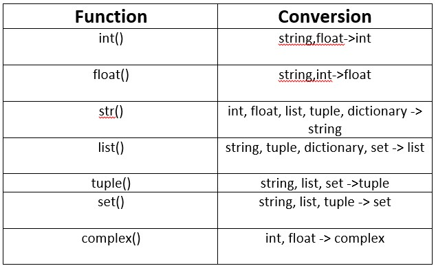

- 🖊️ **Author:** Khurram Shahzad  
- 🎓 **Mentor:** Dr. Aammar Tufail  
- ✉️ **Email:** [khurramamq@gmail.com](mailto:khurramamq@gmail.com)  
- 💻 **GitHub:** [zkskhurram](https://github.com/zkskhurram/Python_-My_Small_knowledge/tree/main)

# 📘 Type Casting

#### ⚙️ **Type casting** in Python is the process of converting one data type into another.


• This is useful when you need to convert between different types, such as turning an integer into a string or a float into an integer.\
• Python provides several built-in functions to accomplish type casting.
## 💡 Benefits
1. **Interoperability:** Type casting allows seamless interaction between systems that represent datWdifferentIy (e.g., strings vs. integers). When users input numeric values as strings, casting them to integers or floats allows the data to be processed for calculations.
2. **Data Cleaning:** Data from various sources such as APIs, files, and user inputs often come in a non-ideal format. Type casting helps normalize this data for further analysis, calculations, or visualizations.
3. **Error Prevention:** Converting types can prevent errors during operations that expect specific data types. For example, performing mathematical operations on strings without casting them to numbers would result in errors.
4. **Efficiency in Data Processing:** In data-heavy applications like sensor readings or financial transactions, converting data to the appropriate types (e.g., float for precision) ensures the

## 💡 Integer to Float (int to float)


```python
# Integer to Float (int to float)
age_int = 10
age_float = float(age_int)
print(type(age_int)) # Output: <Class ‘int’>
print(type(age_float)) # Output: <Class ‘float’>
print(age_float) # Output: 10.0

```

    <class 'int'>
    <class 'float'>
    10.0


## 💡 Float to Integer (float to int)


```python
# Float to Integer (float to int)
age_float = 9.8
age_integer = int(age_float)
print(type(age_integer)) # Output: <Class ‘int’>
print(type(age_float)) # Output: <Class ‘float’>
print(age_integer) # Output: 9
```

    <class 'int'>
    <class 'float'>
    9


## 💡 Float or Integer to String (float or int to str)


```python
# Float or Integer to String (float or int to str)
num_int = 100
num_float = 100.5
num_str = str(num_int)
num_string= str(num_float)
print(num_str) #Output: “100”
print(num_string) #Output: “100.5”
print(type(num_str)) # Output: < Class ‘str’>

```

    100
    100.5
    <class 'str'>


## 💡 String to Float or Integer (str to floast or int)


```python
# String to Float or Integer (str to floast or int)
num_str = "50"
num_int = int(num_str)
print(num_int) # Output: 50
print(type(num_int)) # Output: < class ‘int’ >
num_str = "123.45"
num_float = float(num_str)
print(num_float) # Output: 123.45
print(type(num_float))  # Output: < class ‘float’ >

```

    50
    <class 'int'>
    123.45
    <class 'float'>


## 💡 List to Tuple and vice versa (list to tuple vice versa)


```python
# List to Tuple and vice versa (list to tuple vice versa)
my_list = [1,2,3]
my_tuple_to_list = tuple(my_list) 
print(my_tuple_to_list) # Output: (1,2,3)
print(type(my_tuple_to_list)) # Output: < class ‘tuple’ >
# Example: Tuple to list
my_tuple = (1,2,3)
my_list_to_tuple = list(my_tuple)
print(my_list_to_tuple) # Output: [1,2,3]
print(type(my_list_to_tuple)) # Output: < class ‘list’ >

```

    (1, 2, 3)
    <class 'tuple'>
    [1, 2, 3]
    <class 'list'>


## 💡 List To Set (list to set)


```python
# Example: List to set
my_list = [1,2,3]
my_list_to_set = set(my_list) 
print(my_list_to_set) # Output: {1,2,3}
print(type(my_list_to_set)) # Output: < class ‘set’ >
# Example: Tuple to list
my_set = {1,2,3}
my_set_To_list = list(my_set)
print(my_set_To_list) # Output: [1,2,3]
print(type(my_set_To_list)) # Output: < class ‘list’ >
```

    {1, 2, 3}
    <class 'set'>
    [1, 2, 3]
    <class 'list'>


## 💡 Casting to Boolean (casting to bool)


```python
# Casting to BoolEAN (casting to bool)
num = "None"
bool_value=bool(num)
print(bool_value)  # Output: True
print(type(bool_value)) # Output: < class ‘bool’ >

empty_list = []
bool_empty_list = bool(empty_list)
print(bool_empty_list) # Output: False
print(type(bool_empty_list)) # Output: < class ‘bool’ >

```

    True
    <class 'bool'>
    False
    <class 'bool'>



